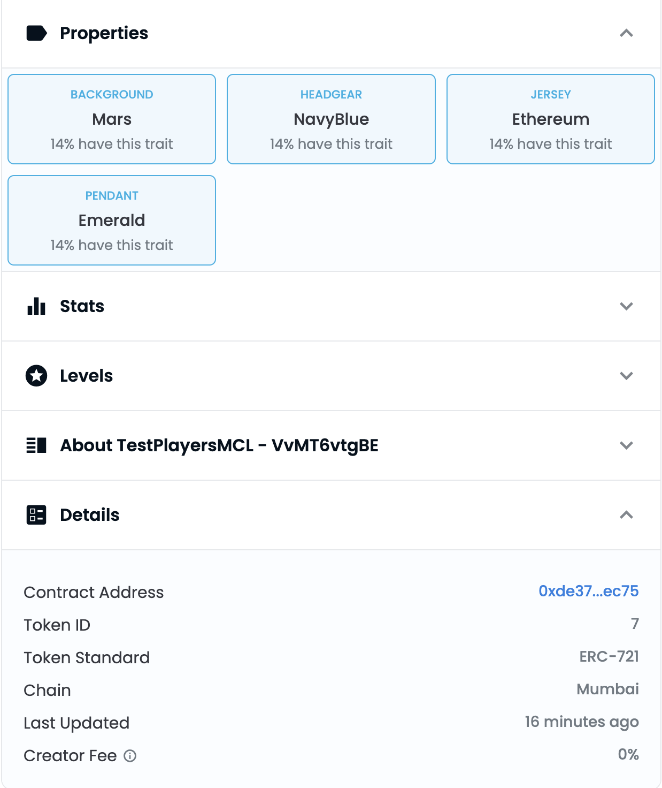

# OnChain-Composable-Generative-NFTs 
An On-Chain NFT collection, where user can compose their own NFT from the list of available attributes. The end user here can customize their NFT, and mint the composed NFT on the fly. Prevention of Duplicates and stitching of the images as per the
combinations are maintained completely OnChain

## Preview and Mint


## Minted Asset

[Opensea TokenId:7](https://testnets.opensea.io/assets/mumbai/0xde37729785107122ffbf8f815c802b93b02cec75/7)
## Getting Started
First, run the development server:

```bash
npm run dev
# or
yarn dev
```

Open [http://localhost:3000](http://localhost:3000) with your browser to see the result.

